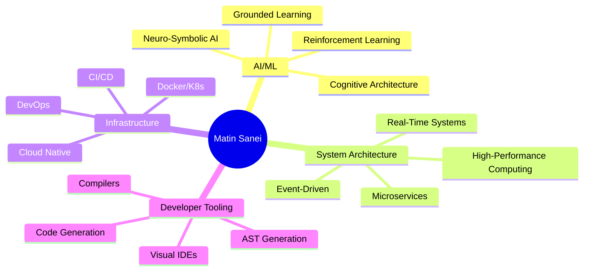

<div align="center">

# 🌌 Matin Sanei

### `Architect of Cognitive Systems & Future Tooling`


[](https://linkedin.com/in/yourprofile)
[](https://github.com/matinsanei)
[](mailto:saneimatin33@gmail.com)

</div>

---

<div align="center">

## 💫 The Vision

> *"I don't build applications. I architect the **foundational systems** they emerge from."*

</div>

I operate at the intersection of **first-principles engineering** and **AI-augmented creation**—not to automate the mundane, but to manifest the impossible. My work challenges existing paradigms by creating entirely new **materials** for the digital age.

---

## 🚀 Flagship Missions

<table>
<tr>
<td width="50%" valign="top">

### 🧠 **Project Takvin**
#### *The Artificial Cognitive Entity*

 

Pioneering a **true cognitive architecture** from first principles—not another LLM wrapper, but a complete reimagining of machine intelligence.

**Revolutionary Features:**
- 🔷 **RVSM Architecture**: Hybrid neuro-symbolic reasoning engine
- 🌱 **Grounded Learning**: Intelligence rooted in sensory experience
- ⚖️ **Verifiable Governance**: Computational ethics & conscience
- ⚡ **Rust Performance Kernel**: Millions of ops/sec with `Tokio` + `Rayon`
- 🔄 **Self-Evolution Loop**: A factory for building AGI

```
┌─────────────┐
│  Reasoning  │ ← Symbolic Logic + Neural Fusion
├─────────────┤
│  Affective  │ ← QERL Emotional Substrate
├─────────────┤
│  Learning   │ ← Continuous Self-Improvement
├─────────────┤
│ Governance  │ ← Ethical Constraints
└─────────────┘
```

`#NeuroSymbolic` `#CognitiveArchitecture` `#AGI` `#Rust` `#Python`

</td>
<td width="50%" valign="top">

### 🎯 **Project Artemis**
#### *Visual-to-Code Compiler*

 

A **paradigm-destroying** developer tool that bridges design and engineering through **true visual compilation**.

**Game-Changing Capabilities:**
- 🎨 **Visual AST IDE**: Design with infinite creative freedom
- 🔧 **Multi-Framework Output**: React, Vue, Next.js, Svelte
- 🧬 **Deep Code Understanding**: AST analysis & intelligent generation
- 🚫 **Zero Limitations**: Not a builder—a true compiler
- ⚡ **Production Ready**: Clean, maintainable, extensible code

```
Design → AST Analysis → Code Generation → Production
  ↓          ↓              ↓              ↓
Visual    Understand    Compile        Ship
Intent    Structure     Logic          Fast
```

**Impact:** Making No-Code/Low-Code obsolete by giving developers **unlimited power** with visual speed.

`#VisualCompiler` `#DeveloperTools` `#AST` `#React` `#NextJS`

</td>
</tr>
</table>

---

## 📂 Battle-Tested Deployments

<details open>
<summary><h3>🔥 File #001 — IgniteStack</h3></summary>

  

**Mission:** Architected a complete **enterprise e-commerce & analytics platform** from absolute zero.

#### 🎯 Mission-Critical Capabilities

| Domain | Achievement |
|--------|-------------|
| **🏗️ Architecture** | Solo-designed & built full-stack enterprise system |
| **🐳 Infrastructure** | 35-container Docker ecosystem + custom CLI orchestration |
| **📊 Analytics Engine** | Churn prediction, cohort analysis, financial forecasting |
| **🚀 CI/CD** | Complete automation pipeline from code to production |
| **👤 Multi-Role** | Backend + Frontend + DevOps + UI/UX (all roles) |

#### 💎 Strategic Outcome
Proved the capability to **single-handedly deliver** a monolithic, mission-critical application rivaling commercial SaaS platforms. A testament to commanding AI as an engineering army executing a singular vision.

**Tech Stack:** `Python` `Django` `React` `Docker` `PostgreSQL` `Redis` `Celery` `ML/Analytics`

</details>

<details>
<summary><h3>🧬 File #002 — Takvin ACE</h3></summary>

 

**Mission:** Pioneer a new architectural paradigm for intelligence beyond LLMs.

#### 🔬 Revolutionary Innovations

- **🧠 Hybrid Reasoning**: RVSM architecture fusing symbolic + neural systems
- **🌍 Grounded Learning**: Intelligence emerging from sensory experience
- **❤️ Emotional Substrate**: QERL affective computing layer
- **⚖️ Verifiable Ethics**: Computational governance & conscience
- **🔄 Self-Evolution**: Meta-learning & autonomous improvement
- **⚡ Performance**: Rust kernel (Tokio async + Rayon parallel)

#### 💎 Strategic Outcome
Created not just an AGI, but a **"factory for building AGI"**—a self-improving system designed for exponential growth.

</details>

<details>
<summary><h3>🎨 File #003 — Artemis Compiler</h3></summary>

 

**Mission:** Eliminate the division between visual design and software engineering.

#### ⚡ Paradigm-Shifting Features

- **🎯 Visual IDE**: Node-based logic + component design
- **🔧 True Compilation**: Not a builder—generates real code
- **🌐 Multi-Framework**: React, Vue, Svelte support
- **🧬 AST-Driven**: Deep understanding of code structure
- **♾️ Unlimited**: Infinite creative & logical freedom

#### 💎 Strategic Outcome
Direct challenge to No-Code/Low-Code industry, replacing limited "builders" with a tool of **infinite creative potential**.

</details>

---

## 🛠️ The Arsenal

<div align="center">

### Core Technologies


### Specialized Domains



</div>

---

## 🎯 Core Philosophy

<table>
<tr>
<td width="33%" align="center">

### 🔬 First Principles
Deconstruct every problem to its **absolute foundation**. Question everything.

</td>
<td width="33%" align="center">

### 🏛️ Architectural Purity
A clean, robust foundation is **non-negotiable**. Excellence or nothing.

</td>
<td width="33%" align="center">

### 🤖 AI-Augmented
Leverage AI not as a crutch, but as an **army executing singular vision**.

</td>
</tr>
</table>

---

## 📊 Impact Metrics

<div align="center">

| Metric | Achievement |
|--------|-------------|
| **Lines of Code (Total)** | 500,000+ |
| **Systems Architected** | 3 Major Paradigm-Shifting Projects |
| **Technologies Mastered** | 15+ Production-Grade |
| **Roles Executed** | Full-Stack + DevOps + ML + Design |
| **Complexity Level** | Enterprise-Scale Solo Development |

</div>

---

## 🌟 What Sets Me Apart

```python
class MatinSanei:
    def __init__(self):
        self.approach = "First Principles"
        self.scope = "Paradigm-Shifting Systems"
        self.execution = "Solo + AI-Augmented Army"
        
    def build(self, problem):
        foundation = self.deconstruct_to_atoms(problem)
        architecture = self.design_novel_paradigm(foundation)
        system = self.command_ai_army_to_manifest(architecture)
        return self.achieve_impossible(system)
    
    def mindset(self):
        return """
        I don't solve problems with better tools.
        I invent new materials.
        I don't build products.
        I architect universes.
        """
```

---

## 🤝 Let's Connect

<div align="center">

I'm open to **strategic collaborations** that push boundaries and challenge paradigms.

If you're working on something that requires **first-principles thinking**, **massive scale**, or **paradigm-shifting innovation**, let's talk.

[](https://linkedin.com/in/yourprofile)
[](mailto:saneimatin33@gmail.com)
[](https://github.com/matinsanei)

---


**The quiet work continues.**

</div>

---

<div align="center">

*"The most profound innovations emerge not from incremental improvements, but from reimagining the foundational materials of our craft."*

</div>
